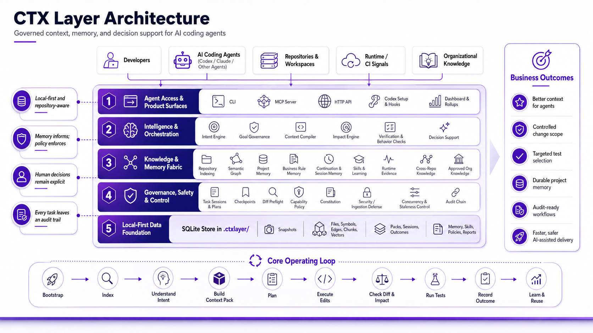

# CTX Layer

## The Governed Execution Layer for AI Coding Agents

CTX Layer transforms AI coding agents from code generators into governed
software engineering systems.

Copyright (c) 2026 Abhilash Pillai. All rights reserved.

Developed by Abhilash Pillai.

CTX Layer sits between an AI coding agent and your codebase.

It provides context intelligence, execution governance, impact awareness,
organizational intelligence, auditability, and continuous improvement.

Without CTX Layer, AI agents generate code.

With CTX Layer, AI agents operate as governed software engineers.

CTX Layer is not a coding agent. It is a governed execution layer that augments
coding agents such as Codex, Claude Code, Cursor, Aider, and MCP-enabled agent
systems. The agent writes code; CTX Layer governs how the agent understands,
plans, validates, learns, and improves.



## Why This Matters

Traditional agent execution is simple:

```text
Prompt
  |
  v
Agent
  |
  v
Code
```

CTX Layer adds the governed execution layer that autonomous coding workflows
need:

```text
Prompt
  |
  v
CTX Layer
  |-- Context Intelligence
  |-- Project and Organizational Intelligence
  |-- Execution Governance
  |-- Impact Analysis
  |-- Skill Library
  |-- Audit Trail
  |-- Continuous Learning
  `-- Decision Support
  |
  v
Agent
  |
  v
Code
```

## What Makes It Different

Most AI coding systems stop after execution. CTX Layer continues:

```text
Agent executes
  |
  v
Outcome captured
  |
  v
Mistake or success analyzed
  |
  v
Root cause identified
  |
  v
Intervention or skill update created
  |
  v
Future behavior improved
```

This makes CTX Layer a governed coding-agent platform with a built-in
cognitive improvement loop.

## Why CTX Layer Exists

| Capability | Standard coding agent | CTX Layer |
| --- | --- | --- |
| Code generation | Yes | Yes |
| Context management | Limited | Yes |
| Execution governance | Limited | Yes |
| Impact analysis | Limited | Yes |
| Project intelligence | Limited | Yes |
| Audit trail | Rare | Yes |
| Root-cause analysis | No | Yes |
| Continuous improvement | No | Yes |
| Organizational knowledge | No | Yes |

CTX Layer exists because autonomous coding is not only a generation problem.
Teams need agents that can operate inside boundaries, explain what happened,
reuse project knowledge, learn from outcomes, and improve across workstreams.

## Current Release

Latest wheel: `ctxlayer-0.2.0a5-py3-none-any.whl`

Release asset:
`https://github.com/abhilashsblai/ctxlayer-release/releases/download/v0.2.0a5/ctxlayer-0.2.0a5-py3-none-any.whl`

SHA256:
`148e4e862d5811c3a6787ae2a457e60b48ad42370853397cd7050475669d1b0b`

Wheel size: `475430` bytes

The `0.2.0a5` build is a preview release for development and non-critical
repositories. Existing users should back up `.ctxlayer/workspace.db` before the
first run after upgrading.

The current wheel was refreshed on 2026-06-22 with the multi-agent adapter
layer for Codex, Claude Code, and Cursor, plus the reliable-enforcement,
large-DB performance, memory optimization, deep-GC, Cognitive Improvement
Engine preview, skill-evolution, and write-time semantic guardrail build.
It was built from Advanced-CTX-Layer source commit `aa62cea`.

### Why Upgrade From Earlier Wheels

Earlier preview wheels could still hit the old large-database startup path. On
the real CTX Layer workspace DB, service construction was measured around
`6,890 ms` to `7,000 ms`. Accessing the large database also made recall feel
like a cold-start bottleneck: before the final `0.2.0a2` hot-path fix,
large-DB memory recall/access was measured around `273 ms` to `314 ms` because
recall resolved a full repository snapshot before scoring memory.

`0.2.0a5` packages the multi-agent adapter layer, performance,
reliable-enforcement, memory optimization, skill-evolution, and write-time
semantic guardrail fixes:

- Multi-agent setup is now adapter-driven. `ctxlayer setup --agents
  codex,claude,cursor` renders native Codex, Claude Code, and Cursor surfaces
  from the same CTX Layer contract.
- `ctxlayer setup auto` detects the running supported agent and renders that
  agent's instruction file, MCP snippets, hooks, subagents, and skills where the
  agent supports them.
- Claude Code setup now writes `CLAUDE.md`, `.claude/settings.json`,
  `.claude/agents/*.md`, `.claude/skills/ctx-loop/SKILL.md`, `.mcp.json`, and
  Claude hook registration that reuses the CTX Layer hook.
- Cursor setup writes `.cursor/rules/ctxlayer.mdc` and `.cursor/mcp.json`, and
  reports `mcp-only` enforcement because Cursor does not provide lifecycle hook,
  subagent, or skill surfaces.
- Steady-state `CtxLayerService` construction is now measured at `1.95 ms` to
  `2.07 ms` median in final bench/release-gate runs.
- The first fixed migration/dedup pass on the large DB was measured at about
  `133 ms`, then future steady-state startup returns to single-digit
  milliseconds.
- Memory recall/access against the large DB is now measured at `9.56 ms` to
  `10.38 ms` median in final bench/release-gate runs; DB-size warnings are still
  surfaced through `ctx_health`.
- Existing DBs with populated `schema_migrations` but `PRAGMA user_version = 0`
  use the count-based migration gate, avoiding unnecessary reconciliation before
  the later `user_version` cleanup.
- Reliability work adds bounded query budgets, persisted health probes,
  fail-loud degraded pack/enforcement status, governed verification artifacts,
  and deep garbage collection for old snapshot content.
- Deep GC now works on production-sized CTX databases with sqlite-vec enabled:
  vector row cleanup is batched below SQLite host-parameter limits, so pruning
  large snapshot generations no longer crashes with `too many SQL variables`.
- Snapshot retention now unpins aged reconstructible context packs before deep
  pruning. This lets old index generations become collectible while preserving
  `bound_snapshot_id` and manifest history for audit/reconstruction.
- Write-time semantic guardrails now flow from governed `memory_enforcement`
  directives into context packs and plans, the Codex PreToolUse gate,
  `check-diff`/CI validation, audited override handling, and dashboard/rollup
  telemetry. Guardrails default to warn mode and can be raised to content-match
  blocking with approval, severity, and confidence floors.
- Large database compaction is explicit and safer. Databases above the compact
  threshold use `VACUUM INTO` to create a verified `.compact` sidecar, report
  `compact_swap_required`, and tell the operator exactly which compact copy must
  replace the live database after CTX processes are stopped.

## Execution Workflow

CTX Layer gives an AI coding agent a structured operating loop:

- Build a deterministic context pack for a task.
- Start a task session and create a structured plan.
- Validate changed files against the active plan step.
- Analyze impact and likely tests for changed paths.
- Check the final diff against the context the agent received.
- Record a durable outcome summary for future tasks.
- Capture project intelligence, decisions, business rules, runtime signals, and
  learned improvement signals.

The core workflow is local-first. Repository state, project intelligence
records, packs, audit entries, dashboard data, and CIE learning runs live in the
project workspace unless you explicitly export or integrate them elsewhere.

## Built For Governed Agent Coding

Coding agents can edit quickly, but they can also miss context, over-edit,
forget project rules, repeat old mistakes, or leave no useful trail for the next
developer or agent. CTX Layer addresses those gaps by making context,
governance, verification, project intelligence, and improvement first-class
parts of the coding loop.

It is designed around one practical question:

Before an agent edits this repository, what does it need to know, what must it
avoid, and how should the result be verified?

## Key Capabilities

- **Context packs**: task-specific snapshots of relevant files, memory, policy,
  impact signals, business rules, runtime evidence, and provenance.
- **Task sessions**: traceable task start, pack serving, plan creation,
  checkpoints, verification, and outcome recording.
- **Structured plans**: JSON-backed plans with objective, steps, intended
  files, intended tests, capabilities, and risk levels.
- **Plan checkpoints**: verifies that edited files belong to the active plan
  step or require an explicit plan amendment.
- **Diff checks**: compares the final diff and changed paths against the served
  context pack and impact closure.
- **Impact reports**: identifies impacted files, linked tests, risk signals,
  critical paths, and review focus.
- **Capability policy**: warns or blocks risky work such as secrets,
  dependency changes, migrations, generated files, CI changes, and critical
  paths.
- **Audit chain**: records task events and outcomes with tamper-evident hashes
  for accidental edits and partial tampering.
- **Project intelligence**: stores outcomes, conventions, gotchas, decisions,
  runtime signals, business rules, and approved project knowledge.
- **MCP support**: exposes CTX Layer tools to MCP-compatible agents and clients.
- **Dashboard and rollups**: renders project, memory, learning, security, CIE,
  and release-health views.

## Cognitive Improvement Engine

The Cognitive Improvement Engine, or CIE, is the newest preview capability in
this release. It tracks recurring mistakes and weak signals, classifies likely
root causes, predicts recurrence risk, proposes checklists and interventions,
and records whether improvements are effective over time.

CIE functionality is enabled by default in the current wheel. Guardrails still
apply: local config overrides, learning-off switches, approval metadata,
required gates, and rollback capability can block adoption.

CIE includes:

- Mistake and near-miss classification.
- Root-cause and meta-root-cause tracking.
- Hypothesis generation and validation.
- Recurrence prediction for risky task patterns.
- Checklist preview and checklist injection support.
- Cognitive-debt scoring.
- Rule effectiveness and decay tracking.
- Improvement score and learning-quality metrics.
- Counterfactual and decision-quality signals.
- Opportunity-cost tracking.
- Controlled adoption, rejection, suspension, and rollback actions.
- CLI, HTTP, MCP, dashboard, and rollup surfaces.

Useful CIE commands:

```powershell
ctxlayer --repo . cie status
ctxlayer --repo . cie predict --task "describe the task" --path src/app.py
ctxlayer --repo . cie checklist-preview --task "describe the task"
ctxlayer --repo . cie cycle --task "review recent work" --limit 20
ctxlayer --repo . cie archive --limit 10
ctxlayer --repo . cie show <run_id>
ctxlayer --repo . cie score
ctxlayer --repo . cie timeline --run-id <run_id>
ctxlayer --repo . cie preview-adoption <intervention_id> --run-id <run_id>
ctxlayer --repo . cie adopt <intervention_id> --run-id <run_id> --approved-by <name>
ctxlayer --repo . cie reject <intervention_id> --run-id <run_id> --reason "not useful"
ctxlayer --repo . cie rollback <intervention_id> --run-id <run_id> --approved-by <name>
```

## More Feature Areas

- **Intent discovery**: creates intent-backed context packs and task framing.
- **Goal governance**: supports goal records, advisory challenges, accepted
  alternatives, and decision traceability.
- **Learning loop**: runs optimization previews, benchmark trends, bounded
  adoption, revert flows, and loop-closure verification.
- **Self-modification controls**: proposes, archives, adopts, and reverts
  controlled self-modification candidates.
- **Decision support**: records questions, options, evidence, unknowns,
  analysis, selected option, rationale, and decision history.
- **Business memory**: extracts and approves business entities, links, rules,
  conflicts, stale records, and impact exposure.
- **Organizational intelligence**: ingests local or exported organization
  sources through redaction, quarantine, approval, and audit flows.
- **Semantic indexing**: indexes semantic findings, graph context, repository
  search, confidence repair, low-confidence findings, and accuracy evaluation.
- **Security gates**: scans secrets and risky text, audits redaction, manages
  quarantine, and ingests red-team fixture results.
- **Runtime evidence**: stores incidents, CI failures, feature flags, and
  operational signals as context and learning candidates.
- **Workspace support**: indexes multiple repositories and records cross-repo
  contracts, edges, packages, schemas, and generated-client relationships.
- **Release and CI support**: emits local CI checks, release validation, audit
  anchors, annotations, and release-gate artifacts.
- **Project registry**: tracks projects where CTX Layer has been installed or
  updated.
- **Memory optimization and maintenance**: reports database size, retention
  state, maintenance history, dry-run GC forecasts, deep snapshot pruning,
  packed vectors, FTS cleanup, edge pruning, aged pack unpinning, and safe
  compact-copy workflows for large workspaces.

## Requirements

- Python 3.11 or newer
- Git
- A terminal with access to the project repository

Optional:

- Codex or another coding agent that reads `AGENTS.md`
- An MCP-compatible client for tool integration
- A virtual environment, `pipx`, or another isolated Python environment

## Install

Install or upgrade directly from the release wheel:

```powershell
python -m pip install --upgrade "https://github.com/abhilashsblai/ctxlayer-release/releases/download/v0.2.0a5/ctxlayer-0.2.0a5-py3-none-any.whl"
```

Verify:

```powershell
ctxlayer --version
```

Expected output:

```text
ctxlayer 0.2.0a5
```

Avoid creating a new `.venv` inside the target project before setup unless you
plan to exclude it from indexing. A virtual environment outside the project is
usually cleaner.

## Configure A Project

Run setup from the root of the repository where you want to use CTX Layer.

For a new folder that is not already a Git repository:

```powershell
ctxlayer --repo . setup --agents codex,claude,cursor --init-git --install-hooks --configure-mcp --absolute-mcp-repo
ctxlayer --repo . doctor
ctxlayer --repo . plan --help
```

For an existing Git repository, omit `--init-git`:

```powershell
ctxlayer --repo . setup --agents codex,claude,cursor --install-hooks --configure-mcp --absolute-mcp-repo
ctxlayer --repo . doctor
ctxlayer --repo . plan --help
```

Setup may create or update:

- `AGENTS.md`
- `ctxlayer.capabilities.yaml`
- `.ctxlayer/`
- local Git hooks, when `--install-hooks` is used
- MCP snippets under `.ctxlayer/mcp/`

Usually commit:

- `AGENTS.md`
- `ctxlayer.capabilities.yaml`

Usually do not commit:

- `.ctxlayer/`

`.ctxlayer/` contains local workspace state, databases, generated context, and
machine-specific MCP snippets.

## Daily Agent Workflow

After setup, the generated `AGENTS.md` asks agents to use this lifecycle:

```powershell
ctxlayer --repo . task start --task "<task>"
ctxlayer --repo . pack --task "<task>"
```

Create a structured task plan:

```powershell
ctxlayer --repo . plan create --task-session-id <task_session_id> --pack-id <pack_id> --file <plan.json>
```

Checkpoint changed files:

```powershell
ctxlayer --repo . plan checkpoint <plan_id> --step-id <step_id> --path <changed_path>
```

Run preflight checks before declaring work complete:

```powershell
git diff HEAD | ctxlayer --repo . check-diff --pack-id <pack_id>
git diff --name-only HEAD | ctxlayer --repo . check-diff --pack-id <pack_id> --paths-from-stdin
git diff --name-only HEAD | ctxlayer --repo . impact --paths-from-stdin
```

Record the outcome:

```powershell
ctxlayer --repo . outcome --pack-id <pack_id> --result pass --summary "<what changed and why>"
```

The outcome summary is important. It becomes durable project memory that future
tasks can retrieve.

## Common Commands

Project health:

```powershell
ctxlayer --repo . doctor
ctxlayer --repo . index
ctxlayer --repo . gc
ctxlayer --repo . db-stats
ctxlayer --repo . gc --deep --dry-run
ctxlayer --repo . gc --deep
ctxlayer --repo . maintenance history
```

Context, impact, and search:

```powershell
ctxlayer --repo . pack --task "describe the change"
ctxlayer --repo . impact --paths src/app/service.py
git diff --name-only HEAD | ctxlayer --repo . check-diff --pack-id <pack_id> --paths-from-stdin
ctxlayer --repo . search "business rule"
```

Memory and business knowledge:

```powershell
ctxlayer --repo . memory candidates
ctxlayer --repo . memory list
ctxlayer --repo . business entity list
ctxlayer --repo . business link list
```

Learning and CIE:

```powershell
ctxlayer --repo . learning status
ctxlayer --repo . learning loop-verify --all
ctxlayer --repo . cie status
ctxlayer --repo . cie cycle --task "review recent work"
```

Decision support:

```powershell
ctxlayer --repo . decision start --question "Which approach should we use?" --option "A" --option "B"
ctxlayer --repo . decision analyze <decision_id>
ctxlayer --repo . decision record <decision_id> --chosen <option_id> --rationale "why"
```

Security, semantic, and org knowledge:

```powershell
ctxlayer --repo . security scan
ctxlayer --repo . semantic index
ctxlayer --repo . semantic search "checkout flow"
ctxlayer --repo . org ingest --source local --path docs
```

Dashboard, rollup, and MCP:

```powershell
ctxlayer --repo . dashboard render --output .ctxlayer/dashboard.html
ctxlayer --repo . rollup --output .ctxlayer/rollup.json
ctxlayer --repo . mcp
```

HTTP server:

```powershell
ctxlayer --repo . serve --host 127.0.0.1 --port 8765 --auth token
```

## MCP Integration

Setup can generate MCP snippets for supported clients:

```powershell
ctxlayer --repo . setup --agents codex,claude,cursor --configure-mcp --absolute-mcp-repo
```

The MCP server exposes the same local project intelligence used by the CLI:
context packs, impact, memory, learning, CIE, decision support, dashboard data,
and governance flows.

For local use:

```powershell
ctxlayer --repo . mcp
```

Review generated `.ctxlayer/mcp/` files before copying them into a client
configuration.

## Upcoming Enhancements

The next planned areas build on the current memory, reliability, and learning
foundation:

- **Organizational agent skill enhancement**: promote proven project-level
  agent skills into organization-level skill libraries, validate them across
  repositories, track ownership and approval, and route the right skill guidance
  into context packs for each team or codebase.
- **Cross-project memory governance**: improve privacy checks, redaction,
  approval workflows, and revalidation before a local lesson or skill becomes
  reusable organization knowledge.
- **Cold memory tiering**: summarize or archive old, low-access memories and
  index generations while keeping current recall fast and bounded.
- **Automated compact swap support**: add a guarded command to perform the
  verified `.compact` database swap when no CTX process is holding the live DB.
- **Retention policy controls**: expose more per-repo and per-target retention
  policy options through CLI, MCP, dashboard, and release-health views.
- **Large-workspace diagnostics**: add clearer dashboards for table growth,
  pinned snapshots, context-pack aging, vector storage, and reclaim estimates.
- **Enterprise rollout controls**: strengthen multi-repo policy packs,
  release gates, team dashboards, and audit exports for managed deployments.

## Updating Existing Workspaces

Back up the workspace database before first use of this preview on an important
repository:

```powershell
Copy-Item .ctxlayer\workspace.db .ctxlayer\workspace.db.pre-0.2.0a5.bak
```

Install the current wheel:

```powershell
python -m pip install --upgrade "https://github.com/abhilashsblai/ctxlayer-release/releases/download/v0.2.0a5/ctxlayer-0.2.0a5-py3-none-any.whl"
```

Then verify:

```powershell
ctxlayer --version
ctxlayer --repo . doctor
ctxlayer --repo . index
ctxlayer --repo . pack --task "release update smoke test"
ctxlayer --repo . cie status
ctxlayer --repo . db-stats
ctxlayer --repo . gc --deep --dry-run
```

If `ctxlayer --repo . gc --deep` reports `compact_swap_required: true`, CTX has
created and verified a compact database copy, usually named
`.ctxlayer/workspace.db.compact`. Stop CTX processes, back up the live
`.ctxlayer/workspace.db`, then replace it with the compact copy. This manual
swap avoids Windows open-file lock issues and makes the reclaim step explicit.

For large existing workspaces, the recommended first maintenance pass is:

```powershell
ctxlayer --repo . db-stats
ctxlayer --repo . gc --deep --dry-run
ctxlayer --repo . gc --deep
ctxlayer --repo . db-stats
```

The dry run shows the expected snapshot, edge, vector, FTS, policy, and aged
context-pack unpinning counts before anything is deleted.

## Safety Notes

- CTX Layer is local-first, but generated configuration and hooks should still
  be reviewed before team-wide adoption.
- Context packs and memory are only as good as the repository state and
  approvals they are built from.
- CIE adoption is enabled by default in this release, but guarded by local
  configuration, approval metadata, learning-off switches, gates, and rollback
  support.
- The audit chain is tamper-evident for accidental edits and partial tampering.
  It is not a substitute for access control on the local workspace database.
- This preview should be exercised on development repositories before use on
  critical production codebases.

## Repository Layout

This release repository contains:

- `releases/`: wheel artifacts for direct installation.
- `docs/`: public documentation and preview assets.
- `README.md`: current release overview and install instructions.
- `LICENSE`: license terms.

The main development source is maintained separately in the Advanced CTX Layer
project. This repository is the public release distribution point.

## License

Copyright (c) 2026 Abhilash Pillai. All rights reserved.

CTX Layer is currently free to use for local, personal, non-commercial projects.
Commercial use, enterprise deployment, resale, redistribution as part of a paid
product or service, hosted service use, and internal company-wide rollout
require prior written permission and a separate commercial license from
Abhilash Pillai.

See [LICENSE](LICENSE) for the full terms.
