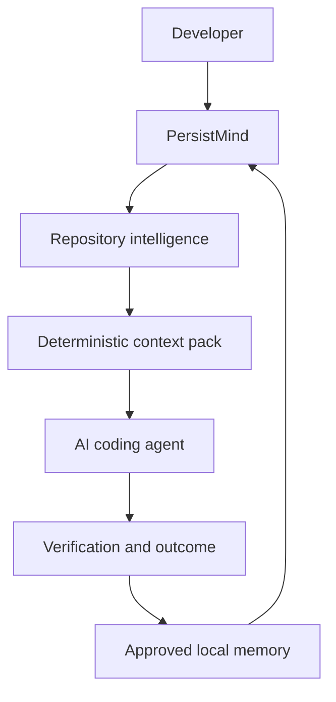

# PersistMind Releases

> Persistent project intelligence and governed local workflows for AI
> engineering.

This repository is the public documentation and release-record surface for
PersistMind. Official release bytes are stored exclusively in version-specific
Google Drive folders. GitHub contains documentation, release notes, checksums,
installation guidance, qualification summaries, and source history only.

## Current release

**PersistMind `0.2.1.dev4` - Internal Windows Preview**

[Open the exact `0.2.1.dev4` Google Drive folder](https://drive.google.com/drive/folders/1HT9bAsR4S9D1bmJ8MtaX9GiweuHK77U1)

This link targets one release. It does not open the parent folder containing
multiple releases.

| Item | Link |
| --- | --- |
| Packaged ZIP | [Download](https://drive.google.com/file/d/1Si6ETnyg5F66gFSgw_nUkhhh_-7-vKWY/view) |
| Python wheel | [Download](https://drive.google.com/file/d/1w0FkMNt3gTQ3d6oM-DMeKt6knyLzyNun/view) |
| SHA-256 checksums | [Download](https://drive.google.com/file/d/1QeKqS7iEQZk8eRJjzzjqgzkuj3K7je1e/view) |
| Windows instructions | [Read](https://drive.google.com/file/d/1CDpY7GIAZRpYnsxNrwAKa3BH-1mlh20O/view) |
| Qualification summary | [Read](https://drive.google.com/file/d/1Jq0jcGhG3LfoQoHg2JC9vRJWAgYLX1nR/view) |
| Release record | [Open](releases/current.md) |

The current release is unsigned, non-production, and restricted to disposable
or non-critical local repositories with manual human review.

## 1. What is PersistMind?

PersistMind sits between a developer, a repository, and an AI coding agent. It
turns repository state into bounded context, tracks governed work, records
verification evidence, and maintains local memory without treating retrieved
text as authority.

PersistMind exists because coding agents often lose repository context, exceed
intended scope, repeat failed approaches, and leave weak evidence about what was
changed or verified. Its core philosophy is local-first operation, explicit
provenance, fail-closed authority, deterministic evidence, and human review.

## 2. Key capabilities

- **Repository intelligence:** explicit indexing, snapshots, lexical search,
  provenance, and impact information.
- **Context packs:** bounded, deterministic task context with token budgets and
  snapshot identity.
- **Local AI memory:** candidate, approved, recalled, revised, and auditable
  project knowledge.
- **Workflow engine:** task sessions, plans, checkpoints, scope assessment,
  verification, outcomes, and continuation.
- **Verification:** commands and results linked to the task, plan, pack, and
  changed paths.
- **Audit:** local evidence and integrity checks separated from ordinary memory.
- **Local-first architecture:** repository state and storage remain local in the
  current supported profile.
- **Agent context:** the same read-only context boundary can serve supported MCP
  clients.

See [capabilities](docs/capabilities.md) and
[current limitations](docs/limitations.md).

## 3. How PersistMind works



The developer defines the task and authority. PersistMind resolves repository
state, prepares bounded context, and records workflow evidence. The coding agent
uses that context; verification and reviewed outcomes feed durable local memory.

## 4. Architecture overview

| Layer | Responsibility |
| --- | --- |
| Entry | CLI and read-only stdio MCP |
| Workflow | Tasks, plans, checkpoints, scope, verification, outcomes |
| Source intelligence | Indexes, search, snapshots, provenance, context packs |
| Memory and policy | Candidate knowledge, approval, recall, authority separation |
| Storage | Local source, task, activity, audit, knowledge, policy, learning roles |
| Learning | Evidence-gated candidates; no automatic adoption in this release |

Read the [architecture guide](docs/architecture.md) for the high-level model.
Implementation detail does not expand a release's qualified boundary.

## 5. Runtime profiles

| Profile | Meaning | Status |
| --- | --- | --- |
| `windows-internal-preview` | Locked local Windows evaluation | Current qualified profile |
| Core Local | Local repository, filesystem, CLI, human review | Current target boundary |
| Labs | Explicit experimental evaluation | Disabled in current release |
| Team Preview | Authenticated team/server operation | Future qualification phase |
| Enterprise | Reviewed multi-user deployment and operations | Future |

See [runtime profiles](docs/runtime-profiles.md).

## 6. Supported features

| Capability | Current release status |
| --- | --- |
| CLI identity, status, doctor | Qualified internal preview |
| Repository indexing and search | Qualified internal preview |
| Deterministic context packs | Qualified internal preview |
| Workflow engine | Qualified internal preview |
| Local approved memory and audit | Qualified internal preview |
| Backup and restore | Qualified internal preview |
| Read-only stdio MCP | Qualified policy boundary |
| Team mode and remote writes | Disabled |
| Advanced cognitive improvement | Experimental; non-authoritative |
| Anticipation | Experimental; non-authoritative |
| Automatic self-improvement adoption | Disabled |

"Implemented" and "qualified" are different states. The complete status table
is in [docs/capabilities.md](docs/capabilities.md).

## 7. Release channels

```text
Internal Preview -> Closed Beta -> Public Beta -> Stable -> LTS
```

- **Internal Preview:** narrow evaluation, explicit restrictions, no production
  claim, may be unsigned.
- **Closed Beta:** selected design partners, beta blockers closed, monitored
  installed-artifact soak.
- **Public Beta:** signed public pre-production channel with security and support
  policies.
- **Stable:** production-approved platform matrix, operations, recovery, and
  compatibility policy.
- **LTS:** stable release with an explicit maintenance and end-of-support window.

Read [release channels](releases/channels.md) and the
[release policy](docs/release-policy.md).

## 8. Downloading PersistMind

All official artifacts are distributed through the designated PersistMind
Release Drive. Each release uses one immutable version folder.

GitHub contains only:

- documentation;
- release notes;
- checksums and release metadata;
- installation instructions;
- qualification summaries; and
- source and documentation history.

GitHub must not contain wheels, installers, source distributions, or ZIP
packages. Use [releases/current.md](releases/current.md) for the current exact
folder and artifact links.

## 9. Installation

The current release supports manual Windows installation into an isolated
virtual environment. Verify SHA-256 first, install the local wheel, then confirm
version, source commit, and runtime profile.

- [Getting started](docs/getting-started.md)
- [Installation guide](docs/installation.md)
- [Windows guide](guides/windows.md)
- [Supported platforms](docs/supported-platforms.md)

Linux and macOS are not qualified for `0.2.1.dev4`.

## 10. Updating and rollback

Do not use the trusted automatic updater for the unsigned internal preview.
Install each preview manually in a separate environment and preserve the prior
artifact, checksums, manifest, and verified backup.

Future trusted channels must authenticate signed manifests, verify exact bytes,
stage atomically, test the installed candidate, and retain rollback data.

- [Updater model](docs/updater.md)
- [Upgrade guide](docs/upgrade-guide.md)

## 11. Verification

Current artifact hashes:

| Artifact | SHA-256 |
| --- | --- |
| Wheel | `e91b3f403cb76816cfa608b5848a96c82054e07a0cc3c4e4898c2084af5e9bad` |
| Source distribution | `1375c3b705bad562b9fc1301125d4f910b6e8757edbd11fba32082703f8ff7dc` |
| Packaged ZIP | `fbf8324921182d551c6e28a095ebb366ede9c63bca87961f7ff2ec27f81e2123` |

SHA-256 verifies byte identity. It does not authenticate an unsigned publisher.
Future public and stable channels require authenticated signature verification
in addition to checksums.

## 12. Release qualification

Every release must publish its exact source commit, profile, platform matrix,
installed-artifact results, integrity metadata, known limitations, and evidence
bundle. Evidence cannot be reused after a commit, artifact, schema, or release
tool changes.

Current qualification:

| Target | Result |
| --- | --- |
| Source suite | 1,168 tests; 0 failures; 0 errors; 7 skipped |
| Windows 11 | Passed |
| Windows 10 | Not directly observed |
| Python 3.11-3.13 | Same installed wheel passed |
| Backup/restore | Passed |
| Read-only MCP boundary | Passed |
| Uninstall/source preservation | Passed |
| Linux/macOS | Not qualified |

Source commit:
[`af93e56e54350d82ae0d40a8bdcce71dd0ac7c03`](https://github.com/abhilashsblai/PersistMind/commit/af93e56e54350d82ae0d40a8bdcce71dd0ac7c03).

Read [release qualification](docs/release-qualification.md).

## 13. Release notes and versioning

- [Current release](releases/current.md)
- [Release notes](releases/release-notes/0.2.1.dev4.md)
- [Release history](releases/release-history.md)
- [Changelog](CHANGELOG.md)
- [Known issues](docs/known-issues.md)

Version meanings:

- `.devN`: internal development or preview identity;
- alpha: early external pre-release with incomplete qualification;
- beta: feature-bounded pre-production release;
- stable: production-approved release;
- LTS: stable line with a published maintenance window.

Version syntax never overrides the evidence and channel recorded for the
artifact.

## 14. Roadmap

The near-term sequence is release reliability, Windows closed-beta soak,
team/public-beta security and authorization, then production operations.
Advanced intelligence features are promoted individually only after genuine
usage shows benefit, safety, and rollback readiness.

Read the [high-level roadmap](docs/roadmap.md).

## 15. Documentation

### Product

- [Getting started](docs/getting-started.md)
- [Architecture](docs/architecture.md)
- [Capabilities](docs/capabilities.md)
- [CLI reference](docs/cli-reference.md)
- [MCP guide](docs/mcp.md)
- [Runtime profiles](docs/runtime-profiles.md)
- [Glossary](docs/glossary.md)

### Operations and trust

- [Installation](docs/installation.md)
- [Troubleshooting](docs/troubleshooting.md)
- [Security model](docs/security-model.md)
- [Release policy](docs/release-policy.md)
- [Support lifecycle](docs/support-lifecycle.md)
- [Upgrade guide](docs/upgrade-guide.md)

### Agent and platform guides

- [Codex](guides/codex.md)
- [Claude Code](guides/claude.md)
- [Cursor](guides/cursor.md)
- [VS Code](guides/vscode.md)
- [Windows](guides/windows.md)

## 16. FAQ and troubleshooting

The [FAQ](docs/faq.md) covers licensing, local/offline behavior, Windows
support, resource expectations, MCP authority, and agent/editor roles.

The [troubleshooting guide](docs/troubleshooting.md) covers identity mismatch,
PowerShell, Python installation, indexing, storage, MCP, and expected updater
rejection for unsigned previews.

## 17. Security

The current profile is local-first, read-only over MCP, and fail-closed against
remote authority expansion. Test reports must redact credentials, private
source, private paths, database contents, and signing material.

- [Security policy](SECURITY.md)
- [Security model](docs/security-model.md)
- [Report a vulnerability](SECURITY.md#reporting-a-vulnerability)

## 18. Support and contributing

- [Support](SUPPORT.md)
- [Contributing](CONTRIBUTING.md)
- [Code of conduct](CODE_OF_CONDUCT.md)

The current internal preview has no production, enterprise, response-time, or
compatibility SLA.

## 19. License

PersistMind is distributed under the
[PersistMind Personal Use License](LICENSE). Commercial, enterprise,
institutional, consulting, hosted, and company-wide use requires a separate
written agreement.

Copyright (c) 2026 Abhilash Pillai. All rights reserved.
