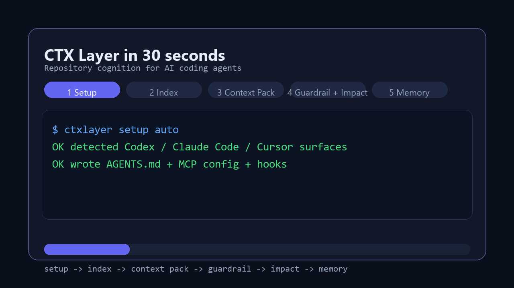
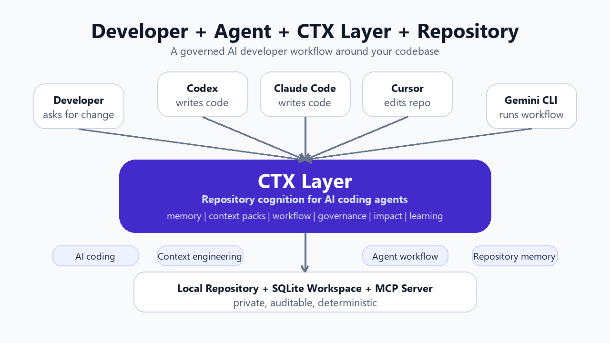

# CTX Layer

[](https://github.com/abhilashsblai/ctxlayer-release/releases/tag/v0.2.0a8)
[](#install-in-2-minutes)
[](LICENSE)
[](#works-with)
[](#works-with)
[](#why-ctx-layer)

Install CTX Layer in under 2 minutes and give your AI coding agent repository
memory, governed workflows, impact analysis, and continuous learning.

CTX Layer is a Repository Cognitive Operating System for AI coding agents.

It gives Codex, Claude Code, Cursor, Gemini CLI, MCP clients, and other
software engineering agents long-term repository memory, context engineering,
coding agent orchestration, deterministic governance, impact analysis,
predictive cognition, and continuous learning.

Copyright (c) 2026 Abhilash Pillai. All rights reserved.

Developed by Abhilash Pillai.

```text
Install -> Index your repository -> Start your first workflow
        -> Get Context Packs -> Catch risky edits -> Record memory
```

## 30 Second Tour



## Choose Your Path

| Time | Do this |
| --- | --- |
| 30 seconds | Watch the terminal tour above. |
| 2 minutes | Run the quick install below. |
| 5 minutes | Complete the five-step tutorial. |
| Deep dive | Open the usage guide and release notes. |

## Install In 2 Minutes

```powershell
python -m pip install --upgrade "https://github.com/abhilashsblai/ctxlayer-release/releases/download/v0.2.0a8/ctxlayer-0.2.0a8-py3-none-any.whl"
ctxlayer --repo . setup auto
ctxlayer --repo . workflow start --task "make a focused change" --path src/app.py
```

That is the shortest path. CTX Layer configures supported agents, creates the
local repository intelligence layer, and starts a governed AI developer
workflow.

## See It Work

Example task:

```text
Fix authentication timeout
```

Example CTX Layer workflow output:

```text
$ ctxlayer --repo . workflow start --task "fix authentication timeout" --path src/auth/session.py

OK Context Pack created
OK Found relevant files:
   - src/auth/session.py
   - tests/test_auth.py
   - docs/token_policy.md
OK Recalled previous timeout failure lesson
OK Impact: 2 APIs, 3 linked tests
RISK auth is a critical path

Next:
ctxlayer --repo . workflow next --task-session-id <task_session_id>
```

The coding agent still writes code. CTX Layer gives the repository memory,
guardrails, workflow state, and verification loop around that agent.

## Product Story



## Why CTX Layer

AI coding agents are powerful, but the raw workflow is mostly stateless. Agents
can read files and write patches, yet they do not automatically remember project
decisions, understand approved business rules, know which tests protect a
behavior, detect scope drift, or learn from previous tasks.

CTX Layer gives the repository cognition. Before an agent edits a codebase, CTX
answers:

```text
What does the agent need to know?
What must it avoid?
What files and tests are impacted?
Did the final diff stay inside scope?
What should be remembered for next time?
```

## Without CTX Layer Vs With CTX Layer

| Raw AI coding agent workflow | With CTX Layer |
| --- | --- |
| Reads whatever files it happens to find | Deterministic Context Packs |
| Forgets prior decisions and gotchas | Durable repository memory |
| Starts from a prompt, not a workflow | AI agent workflow engine |
| Changes can drift outside intended scope | Pack-aware diff validation |
| Test choice is manual or guessed | Impact engine and linked tests |
| Business rules live in scattered docs | Project rule extraction and approval |
| Risk is discovered late in review | Predictive cognition and surprise signals |
| Governance differs per agent | Capability policies and checkpoints |
| Outcomes disappear after the chat ends | Audited task sessions and outcome memory |
| Repeated mistakes stay repeated | Cognitive Improvement Engine |

## Five Minute Tutorial

1. Install the release wheel.

   ```powershell
   python -m pip install --upgrade "https://github.com/abhilashsblai/ctxlayer-release/releases/download/v0.2.0a8/ctxlayer-0.2.0a8-py3-none-any.whl"
   ```

2. Configure the repository for your agent.

   ```powershell
   ctxlayer --repo . setup auto
   ```

3. Start a governed workflow.

   ```powershell
   ctxlayer --repo . workflow start --task "fix checkout validation" --path src/checkout/api.py
   ```

4. Let the agent edit, then ask CTX for the next required step.

   ```powershell
   ctxlayer --repo . workflow next --task-session-id <task_session_id>
   ```

5. Validate and record the result.

   ```powershell
   git diff --name-only HEAD | ctxlayer --repo . impact --paths-from-stdin
   ctxlayer --repo . outcome --pack-id <pack_id> --result pass --summary "what changed and why"
   ```

## Core Product Loop

```text
Repository Indexing
  -> Context Pack
  -> Workflow Plan
  -> Agent Edit
  -> Checkpoint
  -> Diff Validation
  -> Impact Analysis
  -> Tests
  -> Outcome Memory
  -> Continuous Learning
```

## Architecture

Architecture is the proof, not the pitch. CTX Layer is local-first, private,
auditable, and deterministic by default.


## Capabilities

| Repository Cognition | What it gives the agent |
| --- | --- |
| Repository Memory | Decisions, conventions, gotchas, outcomes, and failure lessons. |
| Context Packs | Bounded task context instead of random file search. |
| Workflow Engine | A repeatable `start -> next -> verify -> outcome` loop. |
| Governance | Plans, checkpoints, policies, constitutions, hooks, and CI checks. |
| Impact Analysis | Affected files, linked tests, critical paths, and scope risk. |
| Predictive Cognition | Surprise, lookahead, simulation, and risk signals before damage. |
| Continuous Learning | Future repository intelligence from outcomes and repeated mistakes. |

## Works With

| Surface | Status |
| --- | --- |
| Codex | CLI, MCP config, hooks, AGENTS.md workflow, child-agent coordination |
| Claude Code | MCP setup and shared CTX workflow contract |
| Cursor | MCP setup and shared repository context |
| Gemini CLI | Works through CLI and repository workflow contract |
| MCP | Local stdio server for agent tools |
| HTTP | Local API and dashboard data |
| SQLite | Workspace-scoped local-first storage |
| AGENTS.md | Repository workflow contract for coding agents |
| npm/npx | Local wrapper for Python engine commands |

## Performance Snapshot


| Operation | Earlier preview path | Current preview path |
| --- | ---: | ---: |
| Service startup on large workspace DB | about 6,890-7,000 ms | low single-digit ms |
| Memory recall on large workspace DB | about 273-314 ms | low tens of ms |
| Large DB maintenance | implicit and fragile | explicit health, GC, compact-copy flow |

See the full release notes for the exact v0.2.0a8 scope and caveats:
[docs/releases/v0.2.0a8.md](docs/releases/v0.2.0a8.md).

## Latest Release

Latest wheel: `ctxlayer-0.2.0a8-py3-none-any.whl`

Refreshed build: July 3, 2026 from Advanced CTX Layer source commit
`e152f63b9c0a5f7fef2da2895acc13d51dccc921`

SHA256: `e65ccf2fed6f95b549089ce554be459c0c57467bfb02617b77fa3ad6af6ec5bf`

Wheel size: `630134` bytes

Install:

```powershell
python -m pip install --upgrade "https://github.com/abhilashsblai/ctxlayer-release/releases/download/v0.2.0a8/ctxlayer-0.2.0a8-py3-none-any.whl"
```

Highlights:

- Workflow Orchestrator for `workflow recommend`, `workflow start`, and
  `workflow next`.
- Multi-agent setup for Codex, Claude Code, Cursor, MCP, and AGENTS.md.
- Anticipation and surprise signals for predictive repository cognition.
- Cognitive Improvement Engine preview.
- NextGen runtime surfaces from the latest CTX Layer source update.
- Faster large-database startup, recall, health checks, and maintenance.
- Write-time semantic guardrails and pack-aware diff validation.

## Where CTX Fits

CTX Layer is not a replacement for Codex, Claude Code, Cursor, Aider, Continue,
or LangGraph. It is the repository intelligence and governance layer around AI
coding agents.

| Need | Typical tool | Where CTX Layer fits |
| --- | --- | --- |
| AI coding | Codex, Claude Code, Cursor, Gemini CLI | Gives the agent repository cognition. |
| Context engineering | Prompts, retrieval, MCP tools | Serves deterministic Context Packs. |
| Agent workflow | Manual checklists, scripts | Drives governed `workflow start` / `workflow next`. |
| Repository memory | Chat history, notes | Stores durable local project memory. |
| Governance | Review, CI, policy files | Adds plans, checkpoints, guardrails, and audit. |
| MCP server | MCP-compatible clients | Exposes CTX tools to agents. |

```text
Agent writes code
CTX Layer supplies repository cognition
MCP exposes the tools
AGENTS.md gives the workflow contract
SQLite keeps memory local
```

## Roadmap

```text
Now
  Workflow orchestrator, context packs, repository memory, impact, CIE preview

Next
  Better screenshots, demo recordings, workflow policy packs, richer dashboards

0.3
  Organization memory, cross-project governance, stronger benchmark gates

Enterprise
  Managed policy packs, team dashboards, audit export, multi-repo intelligence
```

## Documentation

- [Usage and command reference](docs/usage.md)
- [v0.2.0a8 release notes](docs/releases/v0.2.0a8.md)
- [GitHub Pages overview](https://abhilashsblai.github.io/ctxlayer-release/)
- [License](LICENSE)

## Safety Notes

- CTX Layer is local-first, but generated configuration and hooks should still
  be reviewed before team-wide adoption.
- Context packs, workflow gates, and memory are only as good as the repository
  state and approvals they are built from.
- Workflow recommendations are governance aids. They do not replace human
  judgment for high-risk migrations, security changes, regulated production
  work, or enterprise rollout decisions.
- This preview should be exercised on development repositories before use on
  critical production codebases.
