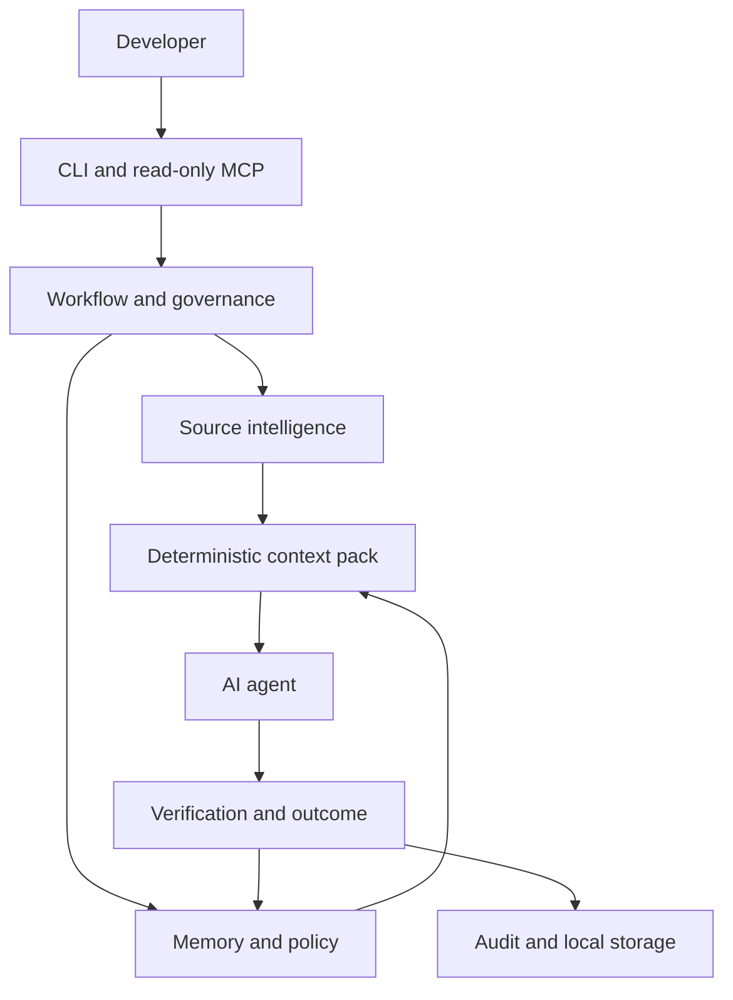

# Architecture

PersistMind is a local-first control and context layer between a developer, a
repository, and an AI coding agent.

## Layers

- **Entry layer:** CLI commands and read-only stdio MCP expose bounded product
  operations.
- **Workflow layer:** task sessions, plans, checkpoints, scope assessment,
  verification, outcomes, and continuation records form the governed loop.
- **Source intelligence:** explicit indexing, lexical search, snapshots,
  provenance, impact information, and deterministic context packs.
- **Memory and policy:** candidate knowledge remains non-authoritative until an
  explicit approval path permits promotion.
- **Storage:** local split storage separates source, task, activity, audit,
  knowledge, policy, and learning roles.
- **Learning:** evidence-gated learning surfaces exist, but automatic adoption
  is disabled in the current release boundary.

Architecture availability does not imply release support. Consult
[capabilities](capabilities.md) and [supported platforms](supported-platforms.md)
for the current qualified boundary.
